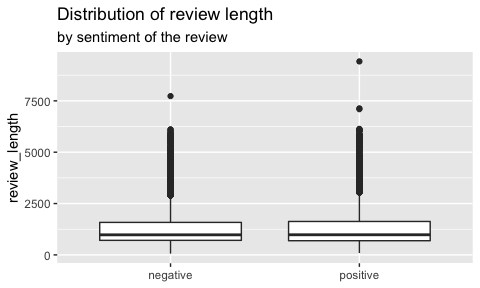
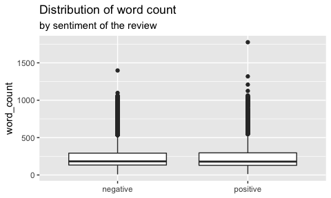
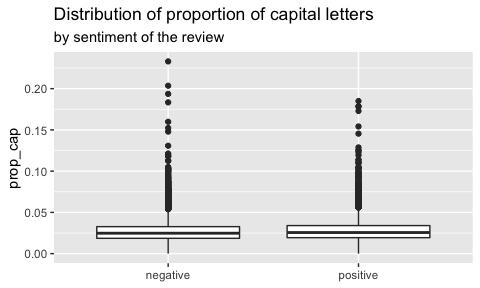
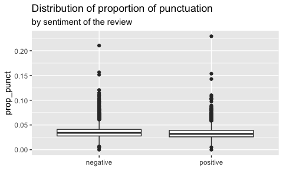
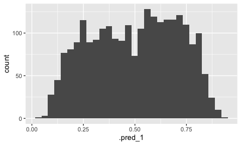
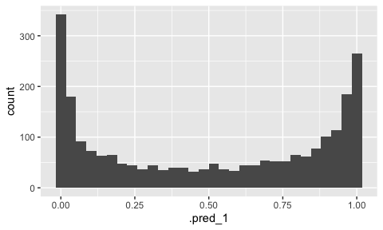
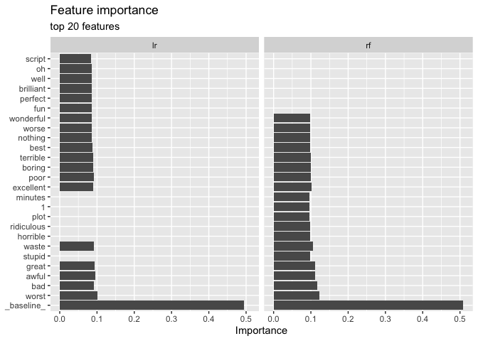
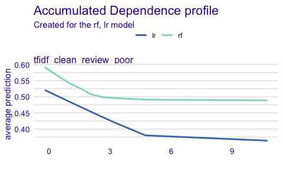
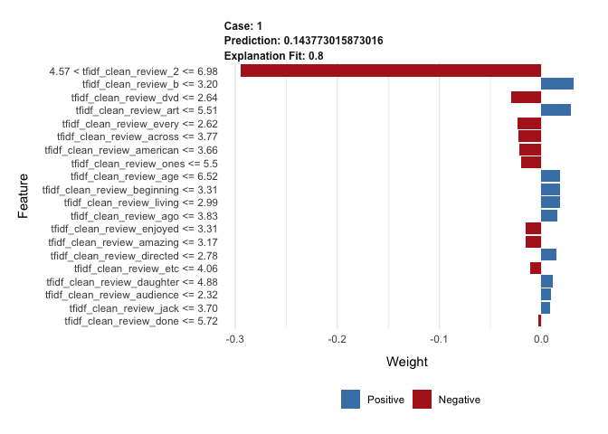
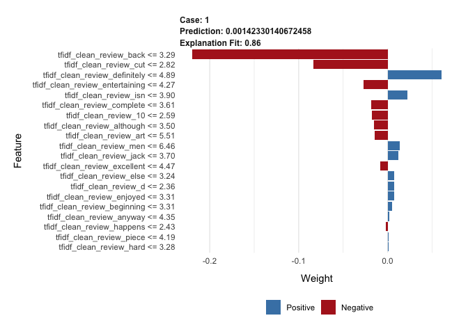

DALEX tutorial on text data
================
Claire Benard

# Introduction

This tutorial goes through an example of using explainable AI techniques
(XAI) on text data.

The data used is open data on film reviews.

I use the `DALEX` and `DALEXtra` packages for XAI because they are
compatible with a lot of frameworks, available for R and Python and
allow a standardised approach to explainability. The downside of this
standardisation is that it is harder to debug as the error messages are
not always easy to link to a specific step of the functions.

# set up

Here is the list of packages used in the tutorial, go ahead and install
them if you don’t have them already.

``` r
library(tidyverse)
library(stringr)
library(textrecipes)
library(tidymodels)
library(randomForest)
library(DALEXtra)

set.seed(1313)
```

The data is available in the data folder in the repository and was
downloaded from
[Kaggle](https://www.kaggle.com/datasets/lakshmi25npathi/imdb-dataset-of-50k-movie-reviews).

The original dataset contains 50,000 rows, I took a sample of 12,000 and
compressed it to upload it to Github so that people could easily
replicate the analysis. Unzip the `csv` and you should be able to run
the tutorial!

``` r
data <- read_csv('data/imdb_dataset.csv', show_col_types = FALSE)
```

Let’s have a look at the first rows.

``` r
head(data %>% select(review, sentiment)) 
```

    ## # A tibble: 6 × 2
    ##   review                                                               sentiment
    ##   <chr>                                                                <chr>    
    ## 1 "As a psychiatrist specialized in trauma, I find this film a beauti… positive 
    ## 2 "The ending of this movie made absolutely NO SENSE. What a waste of… negative 
    ## 3 "I'm not quite sure why, but this movie just doesn't play the way i… negative 
    ## 4 "The title of this movie doesn't make a lot of sense, until you see… positive 
    ## 5 "One of the those \"coming of age\" films that should have nostalgi… negative 
    ## 6 "My mother took me to this movie at the drive-in when i was around … negative

# Exploratory Data Analysis (EDA)

The aim of this tutorial is to demonstrate the use of XAI techniques so
I choose not to spend too much energy on EDA. That said, some basic
analysis of the data can often reveal interesting patterns, data quality
issues or biases that are key to the success of any further modelling.

Outside of a tutorial, I’d encourage you to spend a bit more energy on
this step!

``` r
data %>% count(sentiment)
```

    ## # A tibble: 2 × 2
    ##   sentiment     n
    ##   <chr>     <int>
    ## 1 negative   6017
    ## 2 positive   5983

The data is balanced with roughly the same number of positive and
negative reviews.

Now let’s check if they have similar anatomies: are positive reviews
full of exclamation marks !!! and negative reviews full of ALL CAPS? Or
do people write longer reviews when they loved the film but short sharp
reviews when they’re disappointed?

``` r
# custom boxplot function to standardise EDA
boxplot_features <- function(feat, feat_name){
  
  feature <- enquo(feat)
    ggplot(review_features, aes(!!feature, sentiment)) + 
    geom_boxplot() +
    labs(title = paste('Distribution of', 
                       feat_name),
         subtitle = 'by sentiment of the review',
         y = NULL) +
      coord_flip()
}
```

``` r
review_features <- data %>% 
  mutate(review_length = nchar(review),
         word_count = str_count(review, '\\W+'),
         prop_cap = str_count(review, '[A-Z]') / review_length,
         prop_punct = str_count(review, '[[:punct:]]') / review_length)
```

``` r
boxplot_features(review_length, 'review length')
```

<!-- -->

``` r
boxplot_features(word_count, 'word count')
```

<!-- -->

``` r
boxplot_features(prop_cap, 'proportion of capital letters')
```

<!-- -->

``` r
boxplot_features(prop_punct, 'proportion of punctuation')
```

<!-- -->

The box plots don’t show massive obvious differences between the
anatomies of positive and negative reviews.

# Train 2 models

To illustrate XAI techniques, creating 2 models allows to see how they
may agree but actually use quite different paths to get to the same
results. Conversely, they might disagree and XAI allows us to understand
why.

## Process data to optimise classifier

``` r
# function to remove noise from reviews 
clean_text <- . %>%
  tolower() %>%
  str_replace_all(., '<br />', ' ') %>% # html 
  str_replace_all(., '[:punct:]', ' ') %>% # punctuation
  str_replace_all(., '\\s+', ' ') %>% # several spaces
  trimws()

# convert sentiment to factor as per modelling library requirements
clean_sentiment <- function(sentiment_character){
  fact <- ifelse(str_detect(sentiment_character, 'positive'), 1, 0) %>% 
    factor()
  return(fact)
}

# apply functions
clean_data <- data %>% 
  mutate(clean_review = clean_text(review),
         sentiment_factor = clean_sentiment(sentiment))
```

## train / test split

``` r
data_split <- initial_split(clean_data,
                            strata = sentiment_factor,
                            prop = 0.8)
train_data <- training(data_split)
test_data  <- testing(data_split)
```

## Text processing recipe

Let’s use the recipe package to create the steps to transform the review
from text to a series of features. In this case, we use
[TF-IDF](https://en.wikipedia.org/wiki/Tf%E2%80%93idf) (term frequency
inverse document frequency): a measure of how frequent the word is in a
particular document, relative to how frequent it is across documents.
This helps lower the importance of terms that are very frequent in the
corpus.

``` r
prep_text_rec <-
  recipe(sentiment_factor ~ clean_review + id, data = train_data) %>%
  # Do not use the ID number in the model
  update_role(id, new_role = "ID") %>%
  # Tokenise text
  step_tokenize(clean_review)  %>%
  # Remove stop words
  step_stopwords(clean_review) %>%
  # Only keep the most important words
  step_tokenfilter(clean_review, max_tokens = 500) %>%  
  # Transform each words by its tf_idf values
  step_tfidf(clean_review) %>% 
  # Normalise TFIDF values
  step_normalize(all_numeric())
```

For a great explanation of `prep`, `bake`and `juice` I recommend reading
[this](https://stackoverflow.com/questions/62189885/what-is-the-difference-among-prep-bake-juice-in-the-r-package-recipes)
stackoverflow response.

``` r
train_processed <- prep_text_rec %>% prep() %>% juice()
test_processed <- prep_text_rec %>% prep() %>% bake(test_data)
```

## Fit 2 models

Let’s use a logistic regression and a random forest. They are quite
quick to train and hopefully common enough to avoid creating unnecessary
confusion.

``` r
rf <- rand_forest(
  mode = "classification",
  engine = "ranger",
  trees = 500
  )

rf_fit <- rf %>% fit(sentiment_factor ~ ., data = train_processed)
```

``` r
lr <- logistic_reg(
  mode = "classification",
  engine = "glm"
  )

lr_fit <- lr %>% fit(sentiment_factor ~ ., data = train_processed)
```

    ## Warning: glm.fit: fitted probabilities numerically 0 or 1 occurred

# Generate predictions

``` r
# function bind predictions to the orginal data
add_predict_meta_data <- . %>%
  bind_cols(test_data %>% select(id, sentiment) %>%
              mutate(sentiment_num = ifelse(sentiment == 'positive', 1, 0))) %>% 
  mutate(predict_num = ifelse(.pred_1 > 0.5, 1, 0))
```

## Random forest predictions

Here let’s create use the probabilities rather than the classification.
This enables us to look into the distributions of predictions and
compare them to the DALEX results. Outside of a tutorial, you could just
use the predict function without the `type = 'prob'` argument.

``` r
pred_rf <- predict(rf_fit, test_processed, type = 'prob') %>% 
  add_predict_meta_data()

# calculate the accuracy of the model
# (accuracy = how often the model is right)
pred_rf %>% 
  summarise(accuracy = mean(predict_num == sentiment_num))
```

    ## # A tibble: 1 × 1
    ##   accuracy
    ##      <dbl>
    ## 1    0.815

The random forest gets it right around 80% of the time. Let’s plot the
predictions distribution.

``` r
ggplot(pred_rf, aes(.pred_1)) + geom_histogram()
```

<!-- -->

## Logistic regression predictions

``` r
pred_lr <- predict(lr_fit, test_processed, type = 'prob') %>% 
  add_predict_meta_data()

pred_lr %>% 
  summarise(accuracy = mean(predict_num == sentiment_num))
```

    ## # A tibble: 1 × 1
    ##   accuracy
    ##      <dbl>
    ## 1    0.843

``` r
ggplot(pred_lr, aes(.pred_1)) + geom_histogram()
```

    ## `stat_bin()` using `bins = 30`. Pick better value with `binwidth`.

<!-- -->

The rnadom forest and the logistic regression have a very similar
performance (around 82%) but the distribution of prediction varies
drastically.

# Explainable AI methods

It’s taken a while but here we are: the explainable AI methods.

``` r
# convert a factor to a double as per library requirements
as.double.factor <- function(x) {as.numeric(levels(x))[x]}

# predict would give a class back we want a probability
# so we create a custom predict function
custom_predict <- function(model, new_data){
  as.data.frame(predict(model, new_data, type = "prob"))[,2]
}
```

The `DALEX` and `DALEXtra` packages work with a common syntax: you first
need to create an explainer, this is done with the `explain` function
with `DALEX`. Here, we used `tidymodels` models so we use
`explain_tidymodels`.

Note that the `data` argument takes the processed data, without the
target variable. You can’t just give it `test_data` and let DALEXtra
apply the text recipe.

The first time I ran the function, I also got an error saying that
`DALEX` needed the target variable to be a numeric variable. This is the
opposite of what `parsnip` from `tidymodels` needs. Hence the data type
transformation function `as.double.factor`.

## Explainer for the random forest

``` r
explainer_rf <- DALEXtra::explain_tidymodels(
  # the fitted model
  model = rf_fit,
  # test data, after applying the recipe, without the outcome variable
  data = test_processed %>% select(-sentiment_factor), 
  # outcome variable, as a factor
  y = test_data$sentiment_factor %>% as.double.factor(),
  # label your model for better visuals
  label = 'rf',
  # custom predict function that returns a probability
  predict_function = custom_predict)
```

    ## Preparation of a new explainer is initiated
    ##   -> model label       :  rf 
    ##   -> data              :  2401  rows  501  cols 
    ##   -> data              :  tibble converted into a data.frame 
    ##   -> target variable   :  2401  values 
    ##   -> predict function  :  predict_function 
    ##   -> predicted values  :  No value for predict function target column. (  default  )
    ##   -> model_info        :  package parsnip , ver. 0.2.1 , task classification (  default  ) 
    ##   -> predicted values  :  numerical, min =  0.03796587 , mean =  0.4971412 , max =  0.941431  
    ##   -> residual function :  residual_function 
    ##   -> residuals         :  numerical, min =  0 , mean =  0 , max =  0  
    ##   A new explainer has been created!

Check out the outcome of the `explain_tidymodels` function: sometimes,
it doesn’t error but it actually didn’t work. In this case for example,
the residuals are 0 when the model definitely makes some mistakes - so
we’d expect residuals to be between -1 and 1.

As it turns out, we don’t need residuals here. But ideally, we’d like to
fix this in an another iteration of this notebook!

``` r
mp_rf <- model_performance(explainer_rf)
mp_rf
```

    ## Measures for:  classification
    ## recall     : 0.8287385 
    ## precision  : 0.8065041 
    ## f1         : 0.8174701 
    ## accuracy   : 0.8154935 
    ## auc        : 0.9055602
    ## 
    ## Residuals:
    ##   0%  10%  20%  30%  40%  50%  60%  70%  80%  90% 100% 
    ##    0    0    0    0    0    0    0    0    0    0    0

Other than the residuals, these results look correct: the accuracy
matched what we calculated above.

## Explainer for the logistic regression

``` r
explainer_lr <- DALEXtra::explain_tidymodels(model = lr_fit,
                     data = test_processed,
                     y = test_data$sentiment_factor %>% as.double.factor(),
                     label = 'lr',
                     predict_function = custom_predict)
```

    ## Preparation of a new explainer is initiated
    ##   -> model label       :  lr 
    ##   -> data              :  2401  rows  502  cols 
    ##   -> data              :  tibble converted into a data.frame 
    ##   -> target variable   :  2401  values 
    ##   -> predict function  :  predict_function 
    ##   -> predicted values  :  No value for predict function target column. (  default  )

    ## Warning in predict.lm(object, newdata, se.fit, scale = 1, type = if (type == :
    ## prediction from a rank-deficient fit may be misleading

    ##   -> model_info        :  package parsnip , ver. 0.2.1 , task classification (  default  )

    ## Warning in predict.lm(object, newdata, se.fit, scale = 1, type = if (type == :
    ## prediction from a rank-deficient fit may be misleading

    ##   -> predicted values  :  numerical, min =  2.42165e-09 , mean =  0.5015149 , max =  0.9999991  
    ##   -> residual function :  residual_function 
    ##   -> residuals         :  numerical, min =  0 , mean =  0 , max =  0  
    ##   A new explainer has been created!

`Warning: prediction from a rank-deficient fit may be misleading`
normally indicates that you’re trying to fit a model that has too many
features for the number of observations. Indeed, we are trying to fit a
model with 500 features and only 2400 reviews.

If the aim of this tutorial was to get a reliable model out, this would
be an issue. In this case, it doesn’t stop us using XAI techniques and
it reduces the running time of training and predicting, so I choose to
ignore the warning (#dontdothisathomekids).

``` r
mp_lr <- model_performance(explainer_lr)
mp_lr
```

    ## Measures for:  classification
    ## recall     : 0.8579783 
    ## precision  : 0.8329278 
    ## f1         : 0.8452675 
    ## accuracy   : 0.8433986 
    ## auc        : 0.9165765
    ## 
    ## Residuals:
    ##   0%  10%  20%  30%  40%  50%  60%  70%  80%  90% 100% 
    ##    0    0    0    0    0    0    0    0    0    0    0

Similarly, results are coherent with what was calculated above.

`DALEX` provides a neat way to get performance metrics from different
models. Most of the `DALEX` methods can also be plotted, which is a
convenient characteristic of this library.

# Global explainers

XAI techniques are sometimes split between local and global:

- **global explainers**: use the entire dataset to answer questions
  like:

  - Which features have most impact on the model predictions? -\> here:
    what words are most influencial in the classification of reviews?
  - How does a variation in this feature affect the average prediction?
    -\> here: if you increase the frequency of the word `awesome` in
    reviews, how would that impact the average probability that the
    reviews are classed as ‘positive’
  - How well does the model fit the data?

- **local explainers** are useful to understand one prediction:

  - What factor was decisive in this review being classified as
    ‘negative’?
  - How does the model fit around this prediction?

## Feature importance

`model_parts` is a function used to assess the feature importance - that
is the impact that one particular feature has on the average prediction.
Here, for example it can help us highlight the words that are most
decisive in classifying a review as positive or negative.

The mechanics are pretty simple: the function begins by calculating the
loss for the full model. Then, the values of one variable are permuted
and the loss is recalculated. This process iterates over each variable
in the dataset. Now we start to understand why this is a problem for
text data: here we have short reviews and we already have 500 variables
in our models. So to calculate feature importance, you have to fit 500
models at least.

In addition, permutations are random, so the process is actually
repeated a number of times to get the average results. I just did 6
permutations to make it feasible here so the chunks below train 3000
models. Realistically, global explainers reach their limit pretty fast
on text data that warrants larger models.

``` r
## TAKES ABOUT 9 MIN TO RUN ##
fi_rf <- DALEX::model_parts(explainer_rf, B = 6)
Sys.time()
```

    ## [1] "2023-03-11 20:02:32 CET"

``` r
top_features_rf <- tibble(fi_rf) %>% 
  group_by(variable, label) %>% 
  summarise(av_importance = mean(dropout_loss)) %>% 
  ungroup() %>% 
  top_n(20, wt = av_importance) %>% 
  mutate(word = str_remove(variable, 'tfidf_clean_review_')) 
```

    ## `summarise()` has grouped output by 'variable'. You can override using the
    ## `.groups` argument.

``` r
## TAKES ABOUT 3 MIN TO RUN ##
fi_lr <- DALEX::model_parts(explainer_lr, B = 6)
```

``` r
top_features_lr <- tibble(fi_lr) %>% 
  group_by(variable, label) %>% 
  summarise(av_importance = mean(dropout_loss)) %>% 
  ungroup() %>% 
  top_n(20, wt = av_importance) %>% 
  mutate(word = str_remove(variable, 'tfidf_clean_review_'))
```

``` r
top_features_lr %>% 
  rbind(top_features_rf) %>% 
  ggplot(aes(reorder(word, -av_importance), av_importance)) +
  geom_bar(stat = 'identity') +
  facet_wrap(label ~ .) +
  labs(
    title = 'Feature importance',
    subtitle = 'top 20 features',
    x = NULL,
    y = 'Importance') +
  coord_flip()
```

<!-- -->

While they have very similar performance, the random forest and the
logistic regression don’t follow the same path: some words make it to
both lists of top 20 features but the two lists don’t overlap.

## Accumulated Local Effect (ALE)

ALE curves tell us how a feature influences the predictions of our
models on average. TF-IDF gives you a score for the relative frequency
of a term so the ALE curve for the word ‘poor’ is the average prediction
if you increase the relative frequency of the word ‘poor’ in a review.

``` r
ale_rf <- model_profile(explainer_rf,
                       variables = "tfidf_clean_review_poor",
                       type = "accumulated")

ale_lr <- model_profile(explainer_lr,
                       variables = "tfidf_clean_review_poor",
                       type = "accumulated")

plot(ale_rf, ale_lr)
```

<!-- -->

# Local Interpretable Model-agnostic Explanations (LIME)

Global explainers are insightful but as we highlighted above, they might
reach a limit pretty fast on text data as they are computationally
expensive.

That’s where local explainers, like LIME, come in handy: they
approximate your model locally with an interpretable model to help you
understand why the model made this particular decision, for this
particular review.

What does this mean concretely? LIME generates an artificial dataset
around the prediction you want to explain - essentially, it creates fake
reviews, near the one you need to explain and labels them based on the
black-box model. Then, LIME fits an explainable model on this artificial
dataset to locally approximate the behaviour of the black-box model.

I can’t top the explanation written by the authors of DALEX so I’d
encourage you to read [their chapter](https://ema.drwhy.ai/LIME.html) on
the topic. The illustration is particularly helpful to understand how
the artificial dataset is created and why it’s helpful.

Let’s take the first review of the test set.

``` r
test_data[1,]$review
```

    ## [1] "The ending of this movie made absolutely NO SENSE. What a waste of 2 perfectly good hours. If you can explain it to me...PLEASE DO. I don't usually consider myself unable to \"get\" a movie, but this was a classic example for me, so either I'm slower than I think, or this was a REALLY bad movie."

## Explain the random forest prediction of a review

`predict_surrogate` trains a surrogate model (the linear model or
decision tree approximation of our nonlinear model).

``` r
library(lime)

model_type.dalex_explainer <- DALEXtra::model_type.dalex_explainer
predict_model.dalex_explainer <- DALEXtra::predict_model.dalex_explainer

lime_explain <- DALEXtra::predict_surrogate(explainer_rf, 
                                            model_type.dalex_explainer,
                                            predict_model.dalex_explainer,
                                            seed = 1313,
                                            new_observation = test_processed[1, ], 
                                            n_features = 20, # number of features used to explain the prediction
                                            n_permutations = 150, # number of data points in the artificial dataset
                                            type = 'lime') # package used to implement LIME
```

``` r
plot(lime_explain)
```

<!-- -->

This explainer shows how features individually impacted the
classification of this particular review.

## Explain the logistic regression prediction of a review

``` r
model_type.dalex_explainer <- DALEXtra::model_type.dalex_explainer
predict_model.dalex_explainer <- DALEXtra::predict_model.dalex_explainer

lime_explain_lr <- DALEXtra::predict_surrogate(explainer_lr, 
                                            model_type.dalex_explainer,
                                            predict_model.dalex_explainer,
                                            seed = 1313,
                                            new_observation = test_processed[1, ], 
                                            n_features = 20, 
                                            n_permutations = 150, 
                                            type = 'lime') 
```

``` r
plot(lime_explain_lr)
```

<!-- -->
